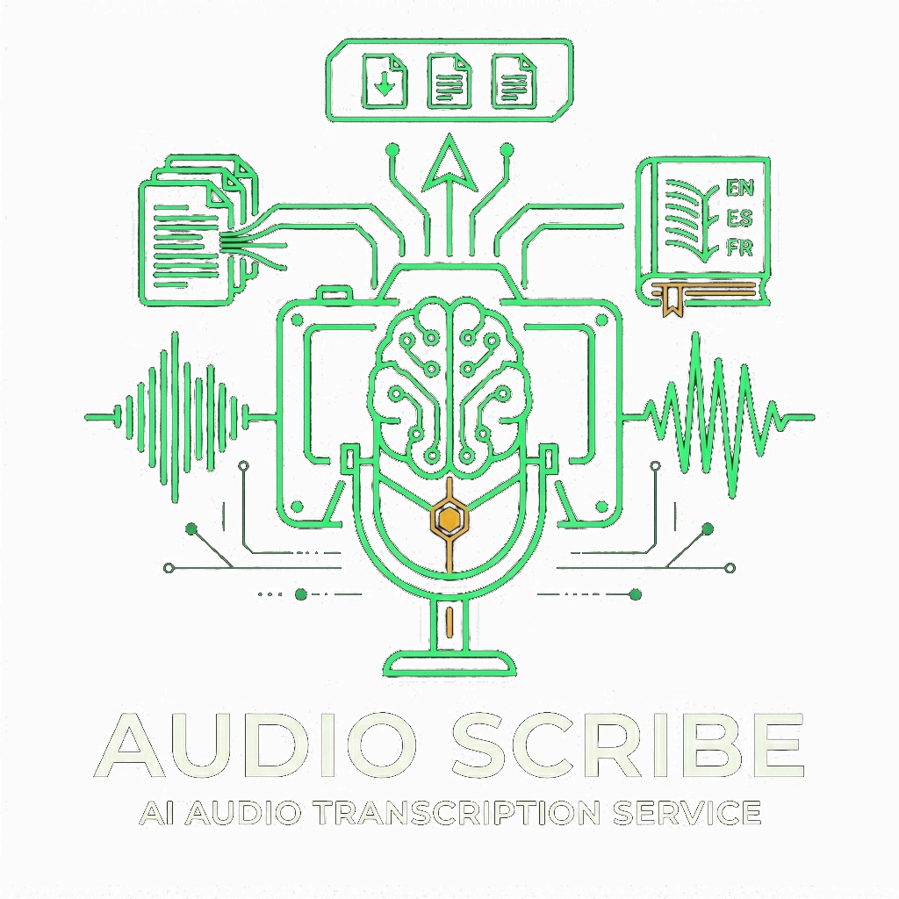

<div align="center">

#  AudioScribe

**AI-powered audio & video transcription and summarization — no GPU required.**

[](https://python.org)
[](https://fastapi.tiangolo.com)
[](LICENSE)
[](https://render.com)
[](https://railway.app)
[](https://www.linkedin.com/in/mo-abdalkader/)

---

### 🌐 Live App

**Try it now:** Deploy your own (see below) — Railway credits expired

### 🤖 Telegram Bot

**Open in Telegram:** [@video_audio_summary_bot](https://t.me/video_audio_summary_bot) *(will be back online after redeploy)*

Send any audio/video file or paste a YouTube/Google Drive/Dropbox link — get a full transcript, intelligent summary, and subtitle files (SRT/VTT) in a ZIP bundle.

---

</div>

## ✨ What You Can Do

| | |
|---|---|
| 🎙 **Transcribe** | Upload any audio/video file or paste a link → get timestamped transcript |
| 🧠 **Summarize** | AI summary in English, Arabic, or Egyptian dialect (Llama 3.3 70B) |
| 🎞 **Subtitles** | SRT/VTT subtitle files — embed into any video player |
| 📦 **ZIP Bundle** | Everything in one download: transcript + summaries + subtitles |
| 🔗 **URL Support** | YouTube, Google Drive, Dropbox, or any direct media link |
| 🤖 **Telegram Bot** | Process files on the go — no browser needed |
| 📱 **PWA** | Installable on mobile/desktop — works offline |
| 🔒 **Private** | Your own Groq API key unlocks unlimited processing (optional) |

---

## ⚙️ How It Works

```
User (Web UI or Telegram)
        │
        ▼
   [1] Upload file or paste URL
        │
        ▼
   [2] Validate format · size · duration
        │
        ▼
   [3] Extract audio from video (ffmpeg — if needed)
        │
        ▼
   [4] Chunk into 25s segments with 3s overlap
        │
        ▼
   [5] Transcribe each chunk (Groq Whisper Large-v3)
        │
        ▼
   [6] Merge chunks · deduplicate overlaps
        │
        ▼
   [7] Summarize (Llama 3.3 70B — map-reduce for long content)
        │      Style: brief/detailed · Tone: pro/casual/technical
        │      Languages: English · Arabic · Egyptian
        ▼
   [8] Package → Transcript · Script · SRT · VTT · Summary · ZIP
        │
        ▼
   Deliver to your device
```

All processing happens server-side. No GPU needed — Groq handles the AI.

### Supported Formats

**Audio:** MP3, WAV, M4A, OGG, FLAC, AAC, OPUS, WEBM  
**Video:** MP4, MKV, AVI, MOV, WMV, FLV, M4V

---

## 🚀 Quick Start (Local Development)

### Prerequisites

```bash
# Python 3.11+
# ffmpeg (required for audio processing)
sudo apt install ffmpeg          # Ubuntu/Debian
brew install ffmpeg              # macOS
# Windows: https://ffmpeg.org/download.html
```

### Setup

```bash
# Clone the repo
git clone https://github.com/Mo-Abdalkader/AudioScribe.git
cd AudioScribe

# Create virtual environment
python -m venv venv
source venv/bin/activate         # Windows: venv\Scripts\activate

# Install dependencies
pip install -r requirements.txt

# Configure environment
cp .env.example .env
```

### Get API Keys (Free)

1. **Groq API key** → [console.groq.com](https://console.groq.com) — 100K tokens/day free
2. **Telegram Bot Token** → Message [@BotFather](https://t.me/botfather) on Telegram to create a bot

Edit `.env` and fill in:
```env
TELEGRAM_BOT_TOKEN=your_token_here
GROQ_API_KEYS=your_gsk_key_here
```

### Run

```bash
python main.py
```

- **Web UI:** [http://localhost:8000](http://localhost:8000)
- **Telegram Bot:** Starts in polling mode automatically
- **API Docs:** [http://localhost:8000/api/docs](http://localhost:8000/api/docs)

---

## 🌐 Deploy

### Render (No Credit Card Needed)

1. **Fork** this repository
2. Go to [render.com](https://render.com) → **New Web Service** → Connect GitHub
3. Use these settings:

   | Setting | Value |
   |---|---|
   | **Build Command** | `apt-get update && apt-get install -y ffmpeg && pip install -r requirements.txt` |
   | **Start Command** | `python main.py` |
   | **Instance** | **Free** |

4. Set env vars: `TELEGRAM_BOT_TOKEN`, `GROQ_API_KEYS`, `WEB_SECRET_KEY`
5. **Deploy** — app lives at `https://audioscribe.onrender.com`

> Free tier sleeps after 15 min idle. Create a free [UptimeRobot](https://uptimerobot.com) monitor pinging `/health` every 5 min to keep it awake.

### Railway (Requires Credit Card)

1. **Fork** this repository
2. Create a new **Railway project** → Deploy from GitHub
3. Set env vars: `TELEGRAM_BOT_TOKEN`, `GROQ_API_KEYS`, `WEB_SECRET_KEY`
4. Railway handles everything automatically:
   - `Procfile` → runs `python main.py`
   - `nixpacks.toml` → installs ffmpeg + Python 3.11
   - `requirements.txt` → installs dependencies
   - `RAILWAY_PUBLIC_DOMAIN` → auto-set for Telegram webhook mode

---

## 🗂️ Project Structure

```
audioscribe/
├── main.py              # Entry point — starts the FastAPI server
├── config.py            # Central configuration from .env
├── Procfile             # Railway deployment process definition
├── nixpacks.toml        # Railway build config (ffmpeg, Python)
├── requirements.txt     # Python dependencies
│
├── core/                # Processing pipeline (shared by web + bot)
│   ├── audio.py         # Audio validation, extraction, chunking
│   ├── transcriber.py   # Groq Whisper transcription
│   ├── summarizer.py    # Llama 3.3 / Cohere summarization
│   ├── output_manager.py# File writing + ZIP bundling
│   └── pipeline.py      # Orchestrates the full pipeline
│
├── bot/                 # Telegram bot
│   ├── main.py          # Bot setup, command registration
│   └── handlers.py      # All command & message handlers
│
└── web/                 # FastAPI web server
    ├── app.py           # API routes, rate limiting, SSRF protection
    ├── templates/       # HTML templates
    └── static/          # CSS, JS, PWA, images
```

---

## 📡 API Endpoints

| Method | Endpoint | Description |
|--------|----------|-------------|
| POST | `/api/process` | Upload audio/video file |
| POST | `/api/process-url` | Submit YouTube/Drive/Dropbox URL |
| GET | `/api/status/{job_id}` | Poll processing progress |
| GET | `/api/download/{job_id}/{file}` | Download result file |
| GET | `/api/limits` | Check rate limit status |
| GET | `/health` | System health check |
| DELETE | `/api/job/{job_id}` | Clean up job from memory |

**Status response example:**
```json
{
  "job_id": "abc123",
  "status": "done",
  "progress": ["Chunking...", "Transcribing 3/12 (25%)", "Done!"],
  "detected_lang": "en",
  "lang_name": "English",
  "files": ["lecture-A3F9-04min-transcript.txt", "lecture-A3F9-04min-audioscribe.zip"]
}
```

Full API reference at `/api/docs` when the server is running.

---

## 🤖 Telegram Bot Commands

| Command | Description |
|---|---|
| `/start` | Welcome & intro |
| `/help` | Full help with your current limits |
| `/info` | Project & developer info |
| `/settings` | Open settings panel with inline buttons |
| `/mode` | Set processing mode (full / transcript / subtitles / summary) |
| `/lang` | Set output language (auto / en / ar / ar-eg / both) |
| `/subtitle_lang` | Set translated subtitle language |
| `/style` | Set summary format (plain / md / both) |
| `/summary_style` | Set detail level (brief / detailed) |
| `/summary_tone` | Set tone (professional / casual / technical) |
| `/key gsk_...` | Add your own Groq API key for higher limits |
| `/key clear` | Clear your API key |
| `/cancel` | Cancel current processing |

Just send any audio/video file or paste a link — no command needed for that.

---

## 🔧 Environment Variables

| Variable | Required | Default | Description |
|---|---|---|---|
| `TELEGRAM_BOT_TOKEN` | Yes* | — | Telegram bot token from @BotFather |
| `GROQ_API_KEYS` | Yes* | — | Groq API key(s) from console.groq.com |
| `COHERE_API_KEY` | No | — | Cohere fallback summarizer |
| `WEB_SECRET_KEY` | No | `change-me` | Webhook validation secret |
| `MAX_FILE_SIZE_MB` | No | 50 | Max file upload size |
| `MAX_AUDIO_DURATION_MINUTES` | No | 60 | Max audio duration |
| `FREE_DAILY_LIMIT` | No | 10 | Daily requests per Telegram user |
| `WEB_ONLY` | No | — | Set to `1` to disable Telegram |

\* At least one API key (Groq or Cohere) must be configured.

---

## 🤝 Contributing

PRs are welcome! Here are ideas:
- **Speaker diarization** — "who said what" using pyannote.audio
- **Google Docs export** — one-click export to Google Docs
- **Persistent job storage** — SQLite/Redis for job history across restarts
- **WebSocket progress** — real-time progress instead of polling
- **More URL sources** — additional cloud storage providers

```bash
git checkout -b feature/your-feature
# Make your changes
git commit -m 'Add your feature'
git push origin feature/your-feature
# Open a Pull Request
```

---

## 📖 Full Documentation

For an exhaustive reference covering every class, function, configuration option, API endpoint, security detail, and architectural decision, see **[Documentation.md](./Documentation.md)**.

---

## 👤 Author

**Mohamed Abdalkader** — AI Engineer

[](https://www.linkedin.com/in/mo-abdalkader/)
[](https://github.com/Mo-Abdalkader)

---

*No audio data is retained. All temporary files are deleted immediately after processing.*
